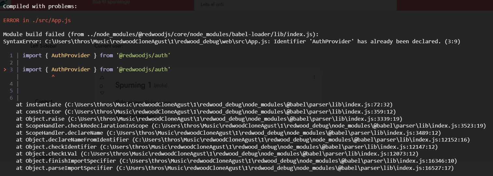

# Uppsetning á síðunni
## 1
Keyrðu
```
yarn install
````
til að fá öll dependency

<br>

## 2
Keyrðu
```
yarn rw prisma migrate dev
```
og
````
yarn rw setup auth dbAuth
````
til að upphafsstilla gögn og auðkenningu

## 3
Ef þessi villa kemur:



Skaltu eyða fyrstu línunni í App.js

## 4
Keyrðu nú
````
yarn rw dev
`````
til að opna dev serverinn. <br>
Hann ætti að opnast sjálfkrafa í <a>localhost:8910</a>


